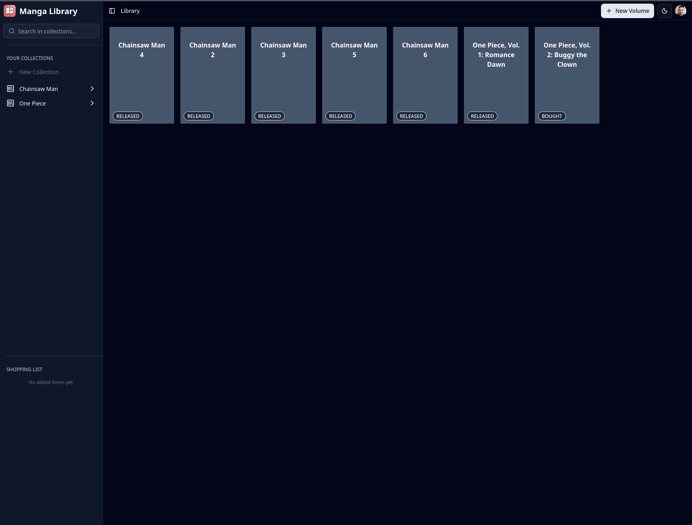

## NextJS Manga Library
A simple web application for managing collections of manga volumes developed in Next.js and React.

You can find an application on this [link](https://nextjs-manga-library.vercel.app).

### Motivation
This application is being developed primarily for me to easily manage my collections of manga volumes 
and in which state they currently are. But also to represent my skills using React and Typescript.

### Technologies
- web application is deployed on **Vercel**
- user is authenticated with **Clerk** authentication
- data are stored on Vercel **PostgreSQL** storage and easily worked using **Prisma**
- **TailwindCSS** and **shadcn/ui** were used for nice looking user interfaces

### Added features
- user authentification
- listing collections and volumes
- creating and editing volumes
- previewing volumes and quick change of status
- context menu for individual volume cards

### Waiting for development
- creating and editing collections
- added volumes to special "shopping" list
- filtering volumes

### Preview Image
